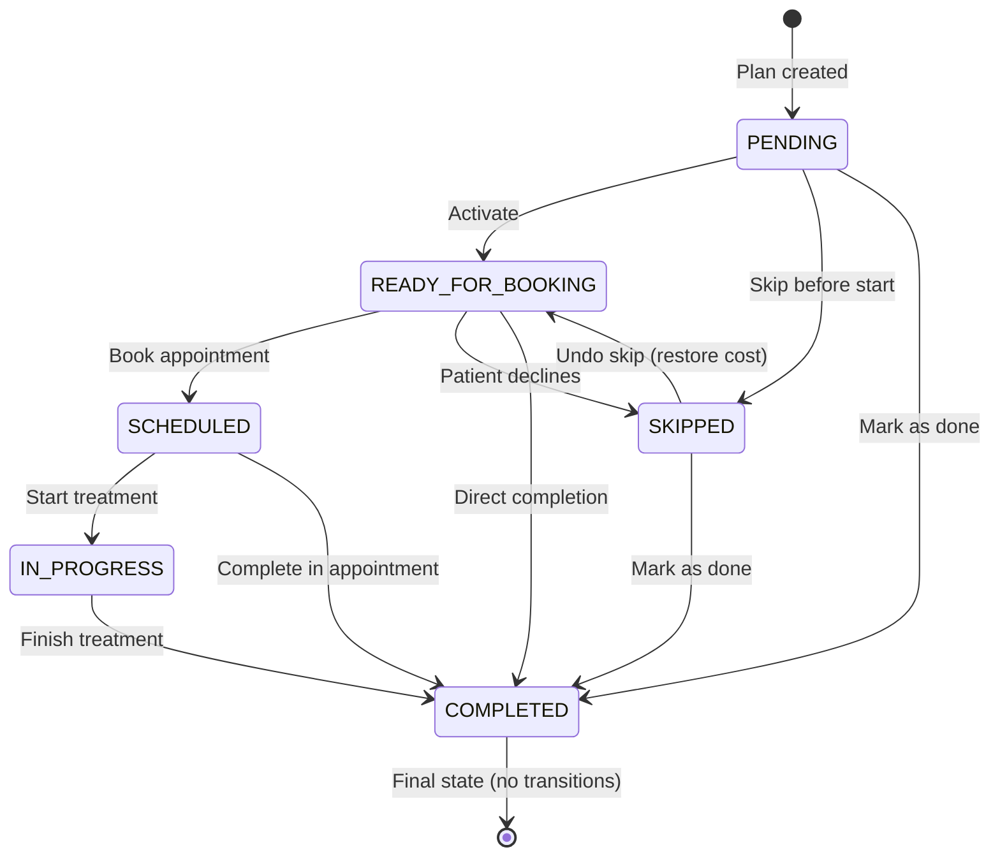

# API 5.6: Update Treatment Plan Item Status

## Tổng Quan (Overview)

API này cho phép cập nhật trạng thái của một hạng mục điều trị (treatment plan item) với đầy đủ logic nghiệp vụ:

- **State Machine Validation**: 11 quy tắc chuyển đổi trạng thái
- **Appointment Validation**: Không được phép SKIP item nếu có cuộc hẹn đang hoạt động
- **Financial Recalculation**: Tự động điều chỉnh chi phí kế hoạch khi skip/unskip item
- **Auto-activation**: Tự động kích hoạt item tiếp theo trong phase khi hoàn thành
- **Auto-complete Phase**: Tự động hoàn thành phase khi tất cả item đã done/skipped
- **Audit Logging**: Ghi log mọi thay đổi trạng thái

---

## Thông Tin API (API Information)

| Thuộc tính              | Giá trị                                      |
| ----------------------- | -------------------------------------------- |
| **HTTP Method**         | `PATCH`                                      |
| **Endpoint**            | `/api/v1/patient-plan-items/{itemId}/status` |
| **Content-Type**        | `application/json`                           |
| **Authorization**       | Bearer Token (JWT)                           |
| **Required Permission** | `UPDATE_TREATMENT_PLAN`                      |
| **Allowed Roles**       | ROLE_ADMIN, ROLE_MANAGER, ROLE_DENTIST       |

---

## State Machine (Sơ Đồ Chuyển Đổi Trạng Thái)

### Transition Rules (11 quy tắc)



### Detailed Transition Table

| From State          | To State            | Allowed?  | Notes                                              |
| ------------------- | ------------------- | --------- | -------------------------------------------------- |
| `PENDING`           | `READY_FOR_BOOKING` |  Yes    | Auto-activation khi item trước hoàn thành          |
| `PENDING`           | `SKIPPED`           |  Yes    | Bỏ qua item trước khi bắt đầu                      |
| `PENDING`           | `COMPLETED`         |  Yes    | Đánh dấu hoàn thành trực tiếp                      |
| `READY_FOR_BOOKING` | `SCHEDULED`         |  Yes    | Được đặt lịch hẹn (API tạo appointment)            |
| `READY_FOR_BOOKING` | `SKIPPED`           |  Yes    | Bệnh nhân từ chối dịch vụ (giảm chi phí plan)      |
| `READY_FOR_BOOKING` | `COMPLETED`         |  Yes    | Hoàn thành trực tiếp không cần hẹn                 |
| `SCHEDULED`         | `IN_PROGRESS`       |  Yes    | Bác sĩ bắt đầu điều trị                            |
| `SCHEDULED`         | `COMPLETED`         |  Yes    | Hoàn thành trong cuộc hẹn                          |
| `SCHEDULED`         | `SKIPPED`           |  **NO** | **Không được phép** - Phải hủy appointment trước   |
| `IN_PROGRESS`       | `COMPLETED`         |  Yes    | Kết thúc điều trị                                  |
| `IN_PROGRESS`       | `SKIPPED`           |  **NO** | **Không được phép** - Đang điều trị không thể skip |
| `SKIPPED`           | `READY_FOR_BOOKING` |  Yes    | **Undo skip** - Thêm lại chi phí vào plan          |
| `SKIPPED`           | `COMPLETED`         |  Yes    | Đánh dấu hoàn thành sau khi skip                   |
| `COMPLETED`         | ANY                 |  **NO** | **Không được phép** - Trạng thái cuối cùng         |

---

## Request Body

### Request Schema

```json
{
  "status": "COMPLETED",
  "notes": "Hoàn thành trong cuộc hẹn APT-20240115-001, bệnh nhân hài lòng",
  "completedAt": "2024-01-15T14:30:00"
}
```

### Field Descriptions

| Field         | Type       | Required | Validation                                                                   | Description                                                                                                   |
| ------------- | ---------- | -------- | ---------------------------------------------------------------------------- | ------------------------------------------------------------------------------------------------------------- |
| `status`      | `string`   |  Yes   | Enum: PENDING, READY_FOR_BOOKING, SCHEDULED, IN_PROGRESS, COMPLETED, SKIPPED | Trạng thái mới (phải tuân theo state machine)                                                                 |
| `notes`       | `string`   |  No    | Max 500 chars                                                                | Ghi chú giải thích lý do thay đổi trạng thái                                                                  |
| `completedAt` | `datetime` |  No    | ISO 8601                                                                     | Thời điểm hoàn thành (chỉ dùng khi status=COMPLETED). Nếu không cung cấp, hệ thống sẽ dùng thời gian hiện tại |

### Validation Rules

1. **Status Transition**: Phải tuân theo state machine (11 rules)
2. **Appointment Check**: Không được skip item có appointment SCHEDULED/IN_PROGRESS/CHECKED_IN
3. **Completed At**: Chỉ áp dụng khi `status = COMPLETED`

---

## Response Body

### Success Response (200 OK)

```json
{
  "itemId": 1001,
  "sequenceNumber": 1,
  "itemName": "Khám và tư vấn ban đầu",
  "serviceId": 101,
  "price": 500000,
  "estimatedTimeMinutes": 30,
  "status": "COMPLETED",
  "completedAt": "2024-01-15T14:30:00",
  "notes": "Hoàn thành trong cuộc hẹn APT-20240115-001",
  "phaseId": 201,
  "phaseName": "Phase 1: Khám và chuẩn bị",
  "phaseSequenceNumber": 1,
  "linkedAppointments": [
    {
      "code": "APT-20240115-001",
      "scheduledDate": "2024-01-15T09:00:00",
      "status": "COMPLETED"
    }
  ],
  "financialImpact": false,
  "financialImpactMessage": null,
  "updatedAt": "2024-01-15T14:30:00",
  "updatedBy": "DR_AN_KHOA"
}
```

### Response Field Descriptions

| Field                        | Type       | Description                                                        |
| ---------------------------- | ---------- | ------------------------------------------------------------------ |
| `itemId`                     | `number`   | ID của item                                                        |
| `sequenceNumber`             | `number`   | Số thứ tự trong phase (1, 2, 3...)                                 |
| `itemName`                   | `string`   | Tên hạng mục điều trị                                              |
| `serviceId`                  | `number`   | ID dịch vụ tham chiếu                                              |
| `price`                      | `number`   | Giá (snapshot khi tạo plan)                                        |
| `estimatedTimeMinutes`       | `number`   | Thời gian ước tính (phút)                                          |
| `status`                     | `string`   | Trạng thái sau khi cập nhật                                        |
| `completedAt`                | `datetime` | Thời điểm hoàn thành (null nếu chưa hoàn thành)                    |
| `notes`                      | `string`   | Ghi chú                                                            |
| `phaseId`                    | `number`   | ID của phase chứa item này                                         |
| `phaseName`                  | `string`   | Tên phase                                                          |
| `phaseSequenceNumber`        | `number`   | Số thứ tự phase                                                    |
| `linkedAppointments`         | `array`    | Danh sách các cuộc hẹn liên kết với item                           |
| **`financialImpact`**        | `boolean`  | **CRITICAL**: `true` nếu thay đổi này ảnh hưởng đến tài chính plan |
| **`financialImpactMessage`** | `string`   | **CRITICAL**: Thông báo chi tiết về tác động tài chính             |
| `updatedAt`                  | `datetime` | Thời điểm cập nhật                                                 |
| `updatedBy`                  | `string`   | Người thực hiện cập nhật                                           |

---

## Financial Impact Logic (CRITICAL)

### Khi nào có tác động tài chính?

| Transition                      | Financial Impact | Action                                          | Example                                  |
| ------------------------------- | ---------------- | ----------------------------------------------- | ---------------------------------------- |
| **ANY → SKIPPED**               |  Yes           | **Giảm** `plan.total_cost` và `plan.final_cost` | Item 500,000 VND → Plan giảm 500,000 VND |
| **SKIPPED → READY_FOR_BOOKING** |  Yes           | **Tăng** `plan.total_cost` và `plan.final_cost` | Undo skip → Plan tăng lại 500,000 VND    |
| Other transitions               |  No            | Không thay đổi chi phí plan                     | PENDING → COMPLETED                      |

### Example: Skip Item

**Request:**

```json
{
  "status": "SKIPPED",
  "notes": "Bệnh nhân từ chối dịch vụ này do ngân sách hạn chế"
}
```

**Response:**

```json
{
  "itemId": 307,
  "price": 500000,
  "status": "SKIPPED",
  "financialImpact": true,
  "financialImpactMessage": "Item skipped: Plan total cost reduced by 500,000 VND"
}
```

**Database Changes:**

```sql
-- Before:
-- plan.total_cost = 15,000,000 VND
-- plan.final_cost = 13,500,000 VND (after 10% discount)

-- After:
-- plan.total_cost = 14,500,000 VND (-500,000)
-- plan.final_cost = 13,000,000 VND (-500,000)
```

### Example: Undo Skip (Restore Cost)

**Request:**

```json
{
  "status": "READY_FOR_BOOKING",
  "notes": "Bệnh nhân quyết định thực hiện dịch vụ này"
}
```

**Response:**

```json
{
  "itemId": 307,
  "price": 500000,
  "status": "READY_FOR_BOOKING",
  "financialImpact": true,
  "financialImpactMessage": "Item re-activated: Plan total cost increased by 500,000 VND"
}
```

---

## Error Responses

### 400 Bad Request - Missing Required Fields

```json
{
  "timestamp": "2024-01-15T14:30:00",
  "status": 400,
  "error": "Bad Request",
  "message": "Status is required",
  "path": "/api/v1/patient-plan-items/1001/status"
}
```

### 404 Not Found - Item Does Not Exist

```json
{
  "timestamp": "2024-01-15T14:30:00",
  "status": 404,
  "error": "Not Found",
  "message": "Treatment plan item not found with ID: 9999",
  "path": "/api/v1/patient-plan-items/9999/status"
}
```

### 409 Conflict - Invalid State Transition

```json
{
  "timestamp": "2024-01-15T14:30:00",
  "status": 409,
  "error": "Conflict",
  "message": "Invalid status transition: COMPLETED → PENDING. Allowed transitions from COMPLETED are: []",
  "path": "/api/v1/patient-plan-items/1001/status"
}
```

### 409 Conflict - Cannot Skip (Active Appointments)

```json
{
  "timestamp": "2024-01-15T14:30:00",
  "status": 409,
  "error": "Conflict",
  "message": "Cannot skip item: 1 active appointment(s) found. Please cancel appointments first.",
  "path": "/api/v1/patient-plan-items/1001/status"
}
```

### 403 Forbidden - Insufficient Permissions

```json
{
  "timestamp": "2024-01-15T14:30:00",
  "status": 403,
  "error": "Forbidden",
  "message": "Access Denied",
  "path": "/api/v1/patient-plan-items/1001/status"
}
```

---

## Use Cases (Tình Huống Thực Tế)

### Use Case 1: Hoàn Thành Item Trong Cuộc Hẹn

**Scenario**: Bác sĩ hoàn thành "Khám và tư vấn ban đầu" trong cuộc hẹn APT-20240115-001

**Request:**

```bash
curl -X PATCH https://api.example.com/api/v1/patient-plan-items/307/status \
  -H "Authorization: Bearer YOUR_JWT_TOKEN" \
  -H "Content-Type: application/json" \
  -d '{
    "status": "COMPLETED",
    "notes": "Hoàn thành khám tư vấn, bệnh nhân đồng ý kế hoạch điều trị",
    "completedAt": "2024-01-15T10:30:00"
  }'
```

**Expected Result:**

- Item status: `PENDING` → `COMPLETED`
- Item tiếp theo trong phase (sequence 2) tự động chuyển: `PENDING` → `READY_FOR_BOOKING`
- Không có tác động tài chính: `financialImpact = false`

---

### Use Case 2: Skip Item Do Bệnh Nhân Từ Chối

**Scenario**: Bệnh nhân từ chối dịch vụ "Chụp X-quang panorama" (500,000 VND) do ngân sách

**Request:**

```bash
curl -X PATCH https://api.example.com/api/v1/patient-plan-items/308/status \
  -H "Authorization: Bearer YOUR_JWT_TOKEN" \
  -H "Content-Type: application/json" \
  -d '{
    "status": "SKIPPED",
    "notes": "Bệnh nhân từ chối dịch vụ này do ngân sách hạn chế"
  }'
```

**Expected Result:**

- Item status: `READY_FOR_BOOKING` → `SKIPPED`
- **Financial Impact**: `plan.total_cost` giảm 500,000 VND
- **Financial Impact**: `plan.final_cost` giảm 500,000 VND
- Response: `financialImpact = true`, message: "Item skipped: Plan total cost reduced by 500,000 VND"

---

### Use Case 3: Undo Skip (Khôi Phục Item)

**Scenario**: Bệnh nhân đổi ý, quyết định thực hiện dịch vụ đã skip trước đó

**Request:**

```bash
curl -X PATCH https://api.example.com/api/v1/patient-plan-items/308/status \
  -H "Authorization: Bearer YOUR_JWT_TOKEN" \
  -H "Content-Type: application/json" \
  -d '{
    "status": "READY_FOR_BOOKING",
    "notes": "Bệnh nhân đã thay đổi quyết định, muốn thực hiện dịch vụ này"
  }'
```

**Expected Result:**

- Item status: `SKIPPED` → `READY_FOR_BOOKING`
- **Financial Impact**: `plan.total_cost` tăng lại 500,000 VND
- **Financial Impact**: `plan.final_cost` tăng lại 500,000 VND
- Response: `financialImpact = true`, message: "Item re-activated: Plan total cost increased by 500,000 VND"

---

### Use Case 4: Cố Gắng Skip Item Có Appointment (BLOCKED)

**Scenario**: Manager cố skip item đang có appointment SCHEDULED

**Request:**

```bash
curl -X PATCH https://api.example.com/api/v1/patient-plan-items/309/status \
  -H "Authorization: Bearer YOUR_JWT_TOKEN" \
  -H "Content-Type: application/json" \
  -d '{
    "status": "SKIPPED",
    "notes": "Cancel dịch vụ này"
  }'
```

**Expected Result:**

-  **HTTP 409 Conflict**
- Error message: "Cannot skip item: 1 active appointment(s) found. Please cancel appointments first."
- **Action Required**: Phải hủy appointment trước khi skip item

---

### Use Case 5: Auto-Complete Phase

**Scenario**: Hoàn thành item cuối cùng trong phase

**Request:**

```bash
curl -X PATCH https://api.example.com/api/v1/patient-plan-items/315/status \
  -H "Authorization: Bearer YOUR_JWT_TOKEN" \
  -H "Content-Type: application/json" \
  -d '{
    "status": "COMPLETED",
    "completedAt": "2024-02-01T16:00:00"
  }'
```

**Expected Result:**

- Item status: `IN_PROGRESS` → `COMPLETED`
- **Phase Auto-Completion**: Phase 1 status tự động chuyển: `IN_PROGRESS` → `COMPLETED`
- Phase 1 `completion_date` được set = current date
- Item đầu tiên của Phase 2 tự động kích hoạt: `PENDING` → `READY_FOR_BOOKING`

---

## Security & Permissions

### Required Permission

```java
@PreAuthorize("hasRole('ROLE_ADMIN') or hasAuthority('UPDATE_TREATMENT_PLAN')")
```

### Who Can Use This API?

| Role        | Permission              | Can Update Status? | Notes                                     |
| ----------- | ----------------------- | ------------------ | ----------------------------------------- |
| **ADMIN**   | Always has access       |  Yes             | Full access to all items                  |
| **MANAGER** | `UPDATE_TREATMENT_PLAN` |  Yes             | Can manage all treatment plans            |
| **DENTIST** | `UPDATE_TREATMENT_PLAN` |  Yes             | Can update items in their treatment plans |
| **NURSE**   |  No permission        |  No              | Cannot update item status                 |
| **PATIENT** |  No permission        |  No              | Cannot directly update status             |

---

## Testing Guide

### Prerequisites

1. **Authentication**: Lấy JWT token với role DENTIST hoặc ADMIN

   ```bash
   LOGIN_RESPONSE=$(curl -X POST https://api.example.com/api/v1/auth/login \
     -H "Content-Type: application/json" \
     -d '{"username": "admin", "password": "admin123"}')

   TOKEN=$(echo $LOGIN_RESPONSE | jq -r '.token')
   ```

2. **Test Data**: Tạo treatment plan với items
   ```bash
   # Use API 5.3 to create plan from template
   curl -X POST https://api.example.com/api/v1/patients/BN-1001/treatment-plans \
     -H "Authorization: Bearer $TOKEN" \
     -H "Content-Type: application/json" \
     -d '{
       "sourceTemplateCode": "TPL_ORTHO_METAL",
       "doctorEmployeeCode": "DR_AN_KHOA",
       "discountAmount": 0,
       "paymentType": "INSTALLMENT"
     }'
   ```

### Test Case 1: Complete First Item (Happy Path)

```bash
# GIVEN: Item 307 có status = PENDING
# WHEN: Cập nhật status sang COMPLETED
curl -X PATCH https://api.example.com/api/v1/patient-plan-items/307/status \
  -H "Authorization: Bearer $TOKEN" \
  -H "Content-Type: application/json" \
  -d '{
    "status": "COMPLETED",
    "notes": "Khám tư vấn thành công",
    "completedAt": "2024-01-15T10:30:00"
  }'

# THEN:
# - Response 200 OK
# - Item 307 status = COMPLETED
# - Item 308 (sequence 2) auto-activated to READY_FOR_BOOKING
# - financialImpact = false
```

### Test Case 2: Skip Item (Financial Impact)

```bash
# GIVEN: Item 308 có status = READY_FOR_BOOKING, price = 500,000 VND
# WHEN: Skip item
curl -X PATCH https://api.example.com/api/v1/patient-plan-items/308/status \
  -H "Authorization: Bearer $TOKEN" \
  -H "Content-Type: application/json" \
  -d '{
    "status": "SKIPPED",
    "notes": "Bệnh nhân từ chối"
  }'

# THEN:
# - Response 200 OK
# - Item 308 status = SKIPPED
# - financialImpact = true
# - financialImpactMessage = "Item skipped: Plan total cost reduced by 500,000 VND"
# - Plan total_cost giảm 500,000 VND
# - Plan final_cost giảm 500,000 VND
```

### Test Case 3: Undo Skip (Restore Cost)

```bash
# GIVEN: Item 308 có status = SKIPPED
# WHEN: Undo skip
curl -X PATCH https://api.example.com/api/v1/patient-plan-items/308/status \
  -H "Authorization: Bearer $TOKEN" \
  -H "Content-Type: application/json" \
  -d '{
    "status": "READY_FOR_BOOKING",
    "notes": "Bệnh nhân đổi ý"
  }'

# THEN:
# - Response 200 OK
# - Item 308 status = READY_FOR_BOOKING
# - financialImpact = true
# - financialImpactMessage = "Item re-activated: Plan total cost increased by 500,000 VND"
# - Plan total_cost tăng lại 500,000 VND
```

### Test Case 4: Invalid Transition (Negative Test)

```bash
# GIVEN: Item 307 có status = COMPLETED
# WHEN: Cố chuyển sang PENDING (không hợp lệ)
curl -X PATCH https://api.example.com/api/v1/patient-plan-items/307/status \
  -H "Authorization: Bearer $TOKEN" \
  -H "Content-Type: application/json" \
  -d '{
    "status": "PENDING"
  }'

# THEN:
# - Response 409 Conflict
# - Error: "Invalid status transition: COMPLETED → PENDING. Allowed transitions from COMPLETED are: []"
```

### Test Case 5: Skip With Active Appointment (Negative Test)

```bash
# GIVEN: Item 309 có status = SCHEDULED, có appointment APT-001 với status = SCHEDULED
# WHEN: Cố skip item
curl -X PATCH https://api.example.com/api/v1/patient-plan-items/309/status \
  -H "Authorization: Bearer $TOKEN" \
  -H "Content-Type: application/json" \
  -d '{
    "status": "SKIPPED"
  }'

# THEN:
# - Response 409 Conflict
# - Error: "Cannot skip item: 1 active appointment(s) found. Please cancel appointments first."
```

### Test Case 6: Insufficient Permission (Negative Test)

```bash
# GIVEN: Login as PATIENT (role không có UPDATE_TREATMENT_PLAN)
# WHEN: Cố cập nhật item status
curl -X PATCH https://api.example.com/api/v1/patient-plan-items/307/status \
  -H "Authorization: Bearer $PATIENT_TOKEN" \
  -H "Content-Type: application/json" \
  -d '{
    "status": "COMPLETED"
  }'

# THEN:
# - Response 403 Forbidden
# - Error: "Access Denied"
```

---

## Database Impact

### Tables Modified

| Table                     | Action | Columns Affected                                      |
| ------------------------- | ------ | ----------------------------------------------------- |
| `patient_plan_items`      | UPDATE | `status`, `completed_at`                              |
| `patient_treatment_plans` | UPDATE | `total_price`, `final_cost` (nếu có financial impact) |
| `patient_plan_phases`     | UPDATE | `status`, `completion_date` (khi auto-complete phase) |

### Example SQL Changes (Skip Item)

```sql
-- 1. Update item status
UPDATE patient_plan_items
SET status = 'SKIPPED'
WHERE item_id = 308;

-- 2. Recalculate plan finances
UPDATE patient_treatment_plans
SET
  total_price = total_price - 500000,
  final_cost = final_cost - 500000
WHERE plan_id = (
  SELECT phase.plan_id
  FROM patient_plan_items item
  JOIN patient_plan_phases phase ON item.phase_id = phase.patient_phase_id
  WHERE item.item_id = 308
);
```

---

## Best Practices

### 1. Luôn Kiểm Tra financialImpact

```javascript
const response = await fetch("/api/v1/patient-plan-items/308/status", {
  method: "PATCH",
  headers: {
    Authorization: `Bearer ${token}`,
    "Content-Type": "application/json",
  },
  body: JSON.stringify({
    status: "SKIPPED",
    notes: "Bệnh nhân từ chối",
  }),
});

const data = await response.json();

if (data.financialImpact) {
  // ️ CRITICAL: Notify user about cost change
  alert(`CHÚ Ý: ${data.financialImpactMessage}`);

  // Refresh plan summary to show updated costs
  refreshPlanSummary(data.planId);
}
```

### 2. Xử Lý Conflict Error (409)

```javascript
try {
  const response = await updateItemStatus(itemId, "SKIPPED");
} catch (error) {
  if (error.status === 409) {
    if (error.message.includes("active appointment")) {
      // Show action: "Hủy cuộc hẹn trước hoặc giữ nguyên item"
      showCancelAppointmentPrompt(itemId);
    } else {
      // Invalid transition
      showStateTransitionError(error.message);
    }
  }
}
```

### 3. Hiển Thị State Transition Guidance

```typescript
// Frontend: Show allowed next states for current status
const getAllowedTransitions = (currentStatus: string): string[] => {
  const stateMap = {
    PENDING: ["READY_FOR_BOOKING", "SKIPPED", "COMPLETED"],
    READY_FOR_BOOKING: ["SCHEDULED", "SKIPPED", "COMPLETED"],
    SCHEDULED: ["IN_PROGRESS", "COMPLETED"],
    IN_PROGRESS: ["COMPLETED"],
    SKIPPED: ["READY_FOR_BOOKING", "COMPLETED"],
    COMPLETED: [],
  };

  return stateMap[currentStatus] || [];
};

// Disable buttons for invalid transitions
const nextStatuses = getAllowedTransitions(item.status);
```

### 4. Audit Logging Best Practice

```java
// Backend automatically logs via TreatmentPlanItemService
// Log format:
log.info(" Audit: User {} changed item {} from {} to {}",
    currentUser, itemId, currentStatus, newStatus);

// Example output:
//  Audit: User DR_AN_KHOA changed item 307 from PENDING to COMPLETED
```

---

## Troubleshooting

### Problem 1: "Cannot skip item: active appointments found"

**Cause**: Item có appointment đang SCHEDULED/IN_PROGRESS/CHECKED_IN

**Solution**:

1. Kiểm tra `linkedAppointments` trong response
2. Hủy tất cả active appointments trước (API 3.7 - Cancel Appointment)
3. Thử skip lại

```bash
# Step 1: Check appointments
GET /api/v1/patient-plan-items/{itemId}/status

# Step 2: Cancel appointments
PATCH /api/v1/appointments/{appointmentCode}/cancel

# Step 3: Retry skip
PATCH /api/v1/patient-plan-items/{itemId}/status
```

---

### Problem 2: Financial impact không đúng

**Cause**: Frontend cache cũ, chưa refresh plan summary

**Solution**:

```javascript
// Always refresh plan after financial impact
if (response.financialImpact) {
  await refreshPlanDetail(planId); // Re-fetch full plan
}
```

---

### Problem 3: Phase không tự động complete

**Cause**: Vẫn còn item có status = PENDING hoặc READY_FOR_BOOKING

**Solution**:

- Kiểm tra tất cả items trong phase
- Chỉ khi **tất cả** items là COMPLETED hoặc SKIPPED thì phase mới auto-complete

```sql
-- Debug query: Check phase completion status
SELECT
  phase.phase_name,
  COUNT(*) as total_items,
  SUM(CASE WHEN item.status IN ('COMPLETED', 'SKIPPED') THEN 1 ELSE 0 END) as done_items
FROM patient_plan_phases phase
JOIN patient_plan_items item ON item.phase_id = phase.patient_phase_id
WHERE phase.patient_phase_id = 201
GROUP BY phase.patient_phase_id, phase.phase_name;
```

---

## Related APIs

| API     | Purpose                   | Relationship                                   |
| ------- | ------------------------- | ---------------------------------------------- |
| API 5.1 | Get treatment plans list  | Xem danh sách plans trước khi update item      |
| API 5.2 | Get treatment plan detail | Xem chi tiết plan và items                     |
| API 5.3 | Create plan from template | Tạo plan chứa items cần update                 |
| API 5.4 | Create custom plan        | Tạo custom plan với items                      |
| API 5.5 | Get all plans (RBAC)      | Admin view tất cả plans                        |
| API 3.1 | Create appointment        | Tạo appointment làm item chuyển sang SCHEDULED |
| API 3.5 | Update appointment status | Khi appointment COMPLETED, item cũng COMPLETED |
| API 3.7 | Cancel appointment        | Phải cancel appointment trước khi skip item    |

---

## Changelog

### Version 1.0 (2024-01-15)

-  Initial release
-  Implemented 11-rule state machine
-  Added financial recalculation logic (skip/unskip)
-  Added appointment validation (cannot skip if active)
-  Added auto-activate next item
-  Added auto-complete phase
-  Added audit logging
-  Permission: `UPDATE_TREATMENT_PLAN` for ADMIN, MANAGER, DENTIST

---

## Support

Nếu có vấn đề khi sử dụng API này:

1. Kiểm tra error response (400/403/404/409)
2. Xem lại state machine rules
3. Verify permissions (`UPDATE_TREATMENT_PLAN`)
4. Check backend logs với keyword `TreatmentPlanItemService`
5. Liên hệ team backend nếu gặp lỗi 500

**Backend Implementation**: `TreatmentPlanItemService.java`
**Controller**: `TreatmentPlanController.java`
**Permission Required**: `UPDATE_TREATMENT_PLAN`
