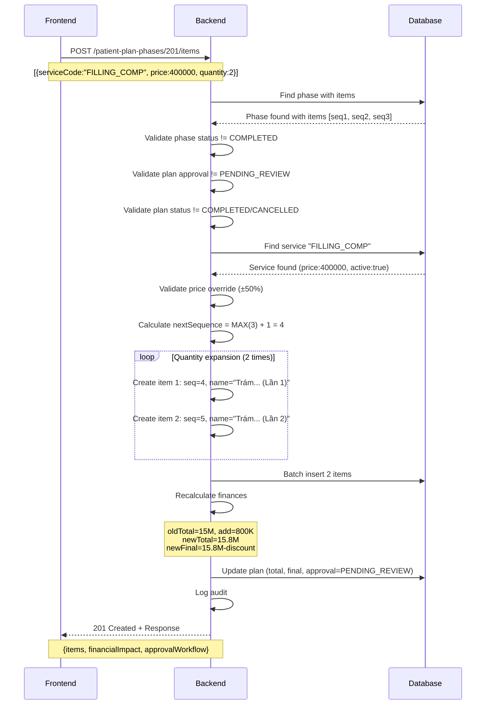

# API 5.7: Add Emergent Items to Treatment Plan Phase

## Tổng Quan (Overview)

API này cho phép thêm các hạng mục phát sinh (emergent/incidental items) vào một phase đã tồn tại của lộ trình điều trị.

**Use Case Thực Tế:**

- Bệnh nhân đang trong lộ trình niềng răng (Phase 1: Chuẩn bị)
- Tại buổi tái khám, Bác sĩ phát hiện 2 răng sâu mới (mặt nhai 46, 47)
- Bác sĩ cần thêm dịch vụ "Trám răng Composite" × 2 vào phase hiện tại
- Hệ thống tự động tính sequence, tăng chi phí, và chuyển plan sang trạng thái chờ duyệt

**Tính Năng Chính:**

-  **Auto-sequence generation**: Backend tự động tính `max(sequence) + 1`
-  **Quantity expansion**: 1 service × 2 quantity = 2 items riêng biệt
-  **Financial recalculation**: Tính lại chi phí plan (đúng logic discount)
-  **Approval workflow**: Plan → PENDING_REVIEW (Quản lý phải duyệt lại)
-  **Comprehensive validation**: Kiểm tra phase/plan status, service active, price range

---

## Thông Tin API (API Information)

| Thuộc tính              | Giá trị                                       |
| ----------------------- | --------------------------------------------- |
| **HTTP Method**         | `POST`                                        |
| **Endpoint**            | `/api/v1/patient-plan-phases/{phaseId}/items` |
| **Content-Type**        | `application/json`                            |
| **Authorization**       | Bearer Token (JWT)                            |
| **Required Permission** | `UPDATE_TREATMENT_PLAN`                       |
| **Allowed Roles**       | ROLE_ADMIN, ROLE_MANAGER, ROLE_DENTIST        |

---

## Request Body

### Request Schema (Array)

```json
[
  {
    "serviceCode": "FILLING_COMP",
    "price": 400000,
    "quantity": 2,
    "notes": "Phát hiện 2 răng sâu mặt nhai 46, 47 tại tái khám ngày 15/01/2024"
  }
]
```

### Field Descriptions

| Field         | Type      | Required | Validation                                                            | Description                                                     |
| ------------- | --------- | -------- | --------------------------------------------------------------------- | --------------------------------------------------------------- |
| `serviceCode` | `string`  |  Yes   | Max 50 chars, must exist in services table                            | Mã dịch vụ cần thêm (snapshot từ services)                      |
| `price`       | `decimal` |  Yes   | > 0, max 10 integer digits + 2 decimals, within ±50% of service price | Giá snapshot (Bác sĩ có thể override giá gốc trong khoảng ±50%) |
| `quantity`    | `integer` |  Yes   | 1-10                                                                  | Số lượng (BE sẽ expand ra nhiều items)                          |
| `notes`       | `string`  |  No    | Max 500 chars                                                         | Lý do/ghi chú (quan trọng cho việc duyệt)                       |

### ️ QUAN TRỌNG: Không có sequenceNumber

**Design Decision (P0 Fix):**

-  **Không cho phép** FE gửi `sequenceNumber`
-  **Backend tự động** tính: `nextSequence = MAX(existing_sequences) + 1`

**Lý do:**

- Tránh xung đột sequence (duplicate)
- Tránh lỗ hổng sequence (gaps)
- Đảm bảo tính nhất quán (consistency)

**Example:**

```javascript
//  BAD (Old design - would cause conflicts)
{
  "serviceCode": "FILLING_COMP",
  "sequenceNumber": 3  // User chooses → CONFLICT if already exists!
}

//  GOOD (Current design)
{
  "serviceCode": "FILLING_COMP",
  // Backend auto-calculates: phase has [1,2,3] → new item gets sequence 4
}
```

---

## Validation Rules

### 1. Phase Status Validation

```java
if (phase.getStatus() == PhaseStatus.COMPLETED) {
    throw 409 CONFLICT: "Cannot add items to completed phase"
}
```

**Rationale**: Không thể thêm item vào phase đã hoàn thành

---

### 2. Plan Approval Status Validation

```java
if (plan.getApprovalStatus() == ApprovalStatus.PENDING_REVIEW) {
    throw 409 CONFLICT: "Plan is pending approval. Cannot add items until approved by manager."
}
```

**Rationale**: Nếu plan đang chờ duyệt, không cho phép sửa thêm (phải đợi Manager duyệt xong)

---

### 3. Plan Status Validation

```java
if (plan.getStatus() == TreatmentPlanStatus.COMPLETED ||
    plan.getStatus() == TreatmentPlanStatus.CANCELLED) {
    throw 409 CONFLICT: "Cannot add items to {status} plan"
}
```

**Rationale**: Không thể thêm item vào plan đã đóng (completed/cancelled)

---

### 4. Service Existence & Active Validation

```java
DentalService service = serviceRepository.findByServiceCode(serviceCode)
    .orElseThrow(() -> 404 NOT FOUND: "Service not found with code: {serviceCode}");

if (!service.getIsActive()) {
    throw 400 BAD REQUEST: "Service is not active: {serviceCode}"
}
```

**Rationale**: Service phải tồn tại và đang active

---

### 5. Price Override Validation (±50%)

```java
BigDecimal minPrice = servicePrice * 0.5;
BigDecimal maxPrice = servicePrice * 1.5;

if (requestPrice < minPrice || requestPrice > maxPrice) {
    throw 400 BAD REQUEST: "Price out of range"
}
```

**Example:**

- Service price: 400,000 VND
- Allowed range: 200,000 - 600,000 VND
-  Request price 350,000: OK
-  Request price 700,000: OUT OF RANGE

**Rationale**: Ngăn chặn ghi đè giá quá cao/quá thấp

---

## Business Logic Flow

### Step-by-Step Execution (Transactional)



---

### Detailed Logic

#### **1. Validation Phase**

```java
// Find phase (with plan & items for efficiency)
PatientPlanPhase phase = phaseRepository.findByIdWithPlanAndItems(phaseId);

// Validate phase status
if (phase.status == COMPLETED) → 409 CONFLICT

// Validate plan approval
if (plan.approvalStatus == PENDING_REVIEW) → 409 CONFLICT

// Validate plan status
if (plan.status == COMPLETED || plan.status == CANCELLED) → 409 CONFLICT
```

#### **2. Prepare & Expand Items**

```java
BigDecimal totalCostAdded = 0;
List<PatientPlanItem> itemsToInsert = [];

// Calculate next sequence
int nextSequence = phase.items.stream()
    .mapToInt(item -> item.sequenceNumber)
    .max()
    .orElse(0) + 1;

// Loop through requests
for (request : requests) {
    DentalService service = validateAndGetService(request.serviceCode);
    validatePriceOverride(request.price, service.price, request.serviceCode);

    // Expand by quantity
    for (i = 1; i <= request.quantity; i++) {
        String itemName = buildItemName(service.name, request.quantity, i);

        PatientPlanItem item = new PatientPlanItem(
            phase: phase,
            serviceId: service.id,
            sequenceNumber: nextSequence++,  // Auto-increment
            itemName: itemName,
            price: request.price,
            estimatedTimeMinutes: service.defaultDuration,
            status: PENDING  // Waiting for approval
        );

        itemsToInsert.add(item);
        totalCostAdded += request.price;
    }
}
```

#### **3. Batch Insert**

```java
List<PatientPlanItem> savedItems = itemRepository.saveAll(itemsToInsert);
```

#### **4. Financial Recalculation (P0 FIX - Correct Discount Logic)**

```java
BigDecimal oldTotalCost = plan.getTotalPrice();
BigDecimal newTotalCost = oldTotalCost.add(totalCostAdded);
plan.setTotalPrice(newTotalCost);

// Recalculate final cost (discount is FIXED AMOUNT, not percentage)
BigDecimal newFinalCost = newTotalCost.subtract(plan.getDiscountAmount());
plan.setFinalCost(newFinalCost);

// Example:
// Before: total=15,000,000, discount=1,500,000, final=13,500,000
// Add: +800,000
// After: total=15,800,000, discount=1,500,000, final=14,300,000
```

#### **5. Approval Workflow Update**

```java
ApprovalStatus oldStatus = plan.getApprovalStatus();
plan.setApprovalStatus(ApprovalStatus.PENDING_REVIEW);

// Manager must re-approve because cost changed
```

#### **6. Save Plan**

```java
planRepository.save(plan);
```

#### **7. Audit Log**

```java
log.info(" Audit: User {} added {} items to phase {} (plan {}). " +
         "Total cost increased by {} VND. Plan status → PENDING_REVIEW",
         currentUser, savedItems.size(), phaseId, plan.planCode, totalCostAdded);
```

---

## Response Body

### Success Response (201 Created)

```json
{
  "items": [
    {
      "itemId": 536,
      "sequenceNumber": 6,
      "itemName": "Trám răng Composite (Phát sinh - Lần 1)",
      "serviceCode": "FILLING_COMP",
      "serviceId": 6,
      "price": 400000,
      "estimatedTimeMinutes": 45,
      "status": "PENDING",
      "notes": "Phát hiện 2 răng sâu mặt nhai 46, 47 tại tái khám ngày 15/01/2024",
      "createdAt": "2024-01-15T14:30:00",
      "createdBy": "DR_AN_KHOA"
    },
    {
      "itemId": 537,
      "sequenceNumber": 7,
      "itemName": "Trám răng Composite (Phát sinh - Lần 2)",
      "serviceCode": "FILLING_COMP",
      "serviceId": 6,
      "price": 400000,
      "estimatedTimeMinutes": 45,
      "status": "PENDING",
      "notes": "Phát hiện 2 răng sâu mặt nhai 46, 47 tại tái khám ngày 15/01/2024",
      "createdAt": "2024-01-15T14:30:00",
      "createdBy": "DR_AN_KHOA"
    }
  ],
  "financialImpact": {
    "totalCostAdded": 800000,
    "planTotalCostBefore": 15000000,
    "planTotalCostAfter": 15800000,
    "planFinalCostBefore": 13500000,
    "planFinalCostAfter": 14300000,
    "discountApplied": true,
    "discountAmount": 1500000
  },
  "approvalWorkflow": {
    "approvalRequired": true,
    "previousApprovalStatus": "APPROVED",
    "newApprovalStatus": "PENDING_REVIEW",
    "reason": "Cost change requires manager re-approval"
  },
  "message": "Successfully added 2 items to phase. Plan status changed to PENDING_REVIEW and requires manager approval."
}
```

### Response Field Descriptions

| Field Path                            | Type      | Description                                                |
| ------------------------------------- | --------- | ---------------------------------------------------------- |
| `items[]`                             | `array`   | Danh sách items vừa tạo                                    |
| `items[].itemId`                      | `number`  | ID của item                                                |
| `items[].sequenceNumber`              | `number`  | Số thứ tự (Backend tự generate)                            |
| `items[].itemName`                    | `string`  | Tên item (với suffix "Phát sinh - Lần X" nếu quantity > 1) |
| `items[].serviceCode`                 | `string`  | Mã dịch vụ                                                 |
| `items[].status`                      | `string`  | Luôn = "PENDING" cho items mới                             |
| **`financialImpact`**                 | `object`  | **Thông tin tác động tài chính (quan trọng)**              |
| `financialImpact.totalCostAdded`      | `number`  | Tổng chi phí tăng thêm                                     |
| `financialImpact.planTotalCostBefore` | `number`  | Tổng chi phí plan trước khi thêm                           |
| `financialImpact.planTotalCostAfter`  | `number`  | Tổng chi phí plan sau khi thêm                             |
| `financialImpact.planFinalCostBefore` | `number`  | Chi phí cuối (sau discount) trước                          |
| `financialImpact.planFinalCostAfter`  | `number`  | Chi phí cuối (sau discount) sau                            |
| `financialImpact.discountApplied`     | `boolean` | Có áp dụng discount không                                  |
| **`approvalWorkflow`**                | `object`  | **Trạng thái quy trình duyệt**                             |
| `approvalWorkflow.approvalRequired`   | `boolean` | Luôn = true (Manager phải duyệt lại)                       |
| `approvalWorkflow.newApprovalStatus`  | `string`  | Luôn = "PENDING_REVIEW"                                    |
| `message`                             | `string`  | Thông báo tổng hợp                                         |

---

## Error Responses

### 400 Bad Request - Service Not Found

```json
{
  "timestamp": "2024-01-15T14:30:00",
  "status": 400,
  "error": "Bad Request",
  "message": "Service not found with code: INVALID_CODE",
  "path": "/api/v1/patient-plan-phases/201/items"
}
```

---

### 400 Bad Request - Service Not Active

```json
{
  "timestamp": "2024-01-15T14:30:00",
  "status": 400,
  "error": "Bad Request",
  "message": "Service is not active: OLD_SERVICE",
  "path": "/api/v1/patient-plan-phases/201/items"
}
```

---

### 400 Bad Request - Price Out of Range

```json
{
  "timestamp": "2024-01-15T14:30:00",
  "status": 400,
  "error": "Bad Request",
  "message": "Price for service FILLING_COMP (700000) is out of allowed range (200000 - 600000). Default price: 400000",
  "path": "/api/v1/patient-plan-phases/201/items"
}
```

---

### 404 Not Found - Phase Not Found

```json
{
  "timestamp": "2024-01-15T14:30:00",
  "status": 404,
  "error": "Not Found",
  "message": "Treatment plan phase not found with ID: 9999",
  "path": "/api/v1/patient-plan-phases/9999/items"
}
```

---

### 409 Conflict - Phase Already Completed

```json
{
  "timestamp": "2024-01-15T14:30:00",
  "status": 409,
  "error": "Conflict",
  "message": "Cannot add items to completed phase",
  "path": "/api/v1/patient-plan-phases/201/items"
}
```

---

### 409 Conflict - Plan Pending Approval

```json
{
  "timestamp": "2024-01-15T14:30:00",
  "status": 409,
  "error": "Conflict",
  "message": "Plan is pending approval. Cannot add items until approved by manager.",
  "path": "/api/v1/patient-plan-phases/201/items"
}
```

---

### 409 Conflict - Plan Completed/Cancelled

```json
{
  "timestamp": "2024-01-15T14:30:00",
  "status": 409,
  "error": "Conflict",
  "message": "Cannot add items to COMPLETED plan",
  "path": "/api/v1/patient-plan-phases/201/items"
}
```

---

### 403 Forbidden - Insufficient Permissions

```json
{
  "timestamp": "2024-01-15T14:30:00",
  "status": 403,
  "error": "Forbidden",
  "message": "Access Denied",
  "path": "/api/v1/patient-plan-phases/201/items"
}
```

---

## Use Cases (Tình Huống Thực Tế)

### Use Case 1: Thêm Dịch Vụ Phát Sinh Trong Lộ Trình Niềng Răng

**Scenario:**

- Bệnh nhân BN-1001 đang trong lộ trình niềng răng kim loại
- Phase 1: "Chuẩn bị" đang IN_PROGRESS
- Tại buổi tái khám tháng 3, Bác sĩ phát hiện 2 răng sâu mới (46, 47)
- Bác sĩ cần thêm "Trám răng Composite" × 2 vào Phase 1

**Request:**

```bash
curl -X POST https://api.example.com/api/v1/patient-plan-phases/201/items \
  -H "Authorization: Bearer YOUR_JWT_TOKEN" \
  -H "Content-Type: application/json" \
  -d '[
    {
      "serviceCode": "FILLING_COMP",
      "price": 400000,
      "quantity": 2,
      "notes": "Phát hiện 2 răng sâu mặt nhai 46, 47 tại tái khám tháng 3/2024. Cần trám composite trước khi tiếp tục niềng."
    }
  ]'
```

**Expected Result:**

-  Tạo 2 items mới với sequence 6, 7 (append to end)
-  Plan total_cost: 15,000,000 → 15,800,000 (+800,000)
-  Plan final_cost: 13,500,000 → 14,300,000 (discount 1,500,000 giữ nguyên)
-  Plan approval_status: APPROVED → PENDING_REVIEW
-  Manager nhận thông báo cần duyệt lại plan

---

### Use Case 2: Thêm Nhiều Loại Dịch Vụ Phát Sinh

**Scenario:**

- Phase 2: "Điều chỉnh" đang IN_PROGRESS
- Bác sĩ phát hiện:
  - 1 răng sâu cần trám (FILLING_COMP)
  - 1 răng cần nhổ (EXTRACTION_SIMPLE)

**Request:**

```bash
curl -X POST https://api.example.com/api/v1/patient-plan-phases/202/items \
  -H "Authorization: Bearer YOUR_JWT_TOKEN" \
  -H "Content-Type: application/json" \
  -d '[
    {
      "serviceCode": "FILLING_COMP",
      "price": 400000,
      "quantity": 1,
      "notes": "Răng 36 sâu cần trám"
    },
    {
      "serviceCode": "EXTRACTION_SIMPLE",
      "price": 300000,
      "quantity": 1,
      "notes": "Răng 48 (răng khôn) cần nhổ"
    }
  ]'
```

**Expected Result:**

-  Tạo 2 items:
  - Item 1: "Trám răng Composite (Phát sinh)" - seq 10
  - Item 2: "Nhổ răng đơn giản (Phát sinh)" - seq 11
-  Total cost added: 700,000 VND
-  Plan → PENDING_REVIEW

---

### Use Case 3: Thử Override Giá Ngoài Phạm Vi (Error Case)

**Scenario:**

- Bác sĩ cố gắng ghi đè giá trám răng lên 700,000 (service default: 400,000)
- Vượt quá ±50% range (200,000 - 600,000)

**Request:**

```bash
curl -X POST https://api.example.com/api/v1/patient-plan-phases/201/items \
  -H "Authorization: Bearer YOUR_JWT_TOKEN" \
  -H "Content-Type: application/json" \
  -d '[
    {
      "serviceCode": "FILLING_COMP",
      "price": 700000,  //  Quá cao!
      "quantity": 1
    }
  ]'
```

**Expected Result:**

-  **400 Bad Request**
- Error: "Price for service FILLING_COMP (700000) is out of allowed range (200000 - 600000). Default price: 400000"
- **Action Required**: Bác sĩ phải điều chỉnh giá trong khoảng cho phép

---

### Use Case 4: Thử Thêm Vào Phase Đã Hoàn Thành (Error Case)

**Scenario:**

- Phase 1 đã COMPLETED
- Bác sĩ cố thêm item vào phase này

**Request:**

```bash
curl -X POST https://api.example.com/api/v1/patient-plan-phases/201/items \
  -H "Authorization: Bearer YOUR_JWT_TOKEN" \
  -H "Content-Type: application/json" \
  -d '[{"serviceCode": "FILLING_COMP", "price": 400000, "quantity": 1}]'
```

**Expected Result:**

-  **409 Conflict**
- Error: "Cannot add items to completed phase"
- **Action Required**: Không thể thêm vào phase đã hoàn thành

---

### Use Case 5: Plan Đang Chờ Duyệt (Error Case)

**Scenario:**

- Plan approval_status = PENDING_REVIEW (đang chờ Manager duyệt)
- Bác sĩ cố thêm item mới

**Request:**

```bash
curl -X POST https://api.example.com/api/v1/patient-plan-phases/201/items \
  -H "Authorization: Bearer YOUR_JWT_TOKEN" \
  -H "Content-Type: application/json" \
  -d '[{"serviceCode": "SCALING_L1", "price": 300000, "quantity": 1}]'
```

**Expected Result:**

-  **409 Conflict**
- Error: "Plan is pending approval. Cannot add items until approved by manager."
- **Action Required**: Đợi Manager duyệt xong, sau đó mới được thêm item

---

## Security & Permissions

### Required Permission

```java
@PreAuthorize("hasRole('ROLE_ADMIN') or hasAuthority('UPDATE_TREATMENT_PLAN')")
```

### Who Can Use This API?

| Role        | Permission              | Can Add Items? | Notes                         |
| ----------- | ----------------------- | -------------- | ----------------------------- |
| **ADMIN**   | Always has access       |  Yes         | Full access to all plans      |
| **MANAGER** | `UPDATE_TREATMENT_PLAN` |  Yes         | Can add items to any plan     |
| **DENTIST** | `UPDATE_TREATMENT_PLAN` |  Yes         | Can add items to their plans  |
| **NURSE**   |  No permission        |  No          | Cannot modify treatment plans |
| **PATIENT** |  No permission        |  No          | Cannot directly add items     |

---

## Testing Guide

### Prerequisites

1. **Authentication**: Lấy JWT token với role DENTIST hoặc ADMIN

   ```bash
   LOGIN_RESPONSE=$(curl -X POST https://api.example.com/api/v1/auth/login \
     -H "Content-Type: application/json" \
     -d '{"username": "admin", "password": "admin123"}')

   TOKEN=$(echo $LOGIN_RESPONSE | jq -r '.token')
   ```

2. **Test Data**: Tạo plan với phase

   ```bash
   # Create plan using API 5.3
   curl -X POST https://api.example.com/api/v1/patients/BN-1001/treatment-plans \
     -H "Authorization: Bearer $TOKEN" \
     -H "Content-Type: application/json" \
     -d '{
       "sourceTemplateCode": "TPL_ORTHO_METAL",
       "doctorEmployeeCode": "DR_AN_KHOA",
       "discountAmount": 1500000,
       "paymentType": "INSTALLMENT"
     }'

   # Get plan details to find phaseId
   curl -X GET https://api.example.com/api/v1/patients/BN-1001/treatment-plans/PLAN-001 \
     -H "Authorization: Bearer $TOKEN"
   ```

### Test Case 1: Add Single Item (Happy Path)

```bash
# GIVEN: Phase 201 exists, has items [1,2,3], plan is IN_PROGRESS
# WHEN: Add 1 filling service
curl -X POST https://api.example.com/api/v1/patient-plan-phases/201/items \
  -H "Authorization: Bearer $TOKEN" \
  -H "Content-Type: application/json" \
  -d '[
    {
      "serviceCode": "FILLING_COMP",
      "price": 400000,
      "quantity": 1,
      "notes": "Răng 46 sâu"
    }
  ]'

# THEN:
# - 201 Created
# - items[0].sequenceNumber = 4 (auto-generated)
# - financialImpact.totalCostAdded = 400000
# - approvalWorkflow.newApprovalStatus = "PENDING_REVIEW"
```

### Test Case 2: Add Multiple Items with Quantity Expansion

```bash
# GIVEN: Phase 201 with items [1,2,3]
# WHEN: Add FILLING_COMP × 2
curl -X POST https://api.example.com/api/v1/patient-plan-phases/201/items \
  -H "Authorization: Bearer $TOKEN" \
  -H "Content-Type: application/json" \
  -d '[
    {
      "serviceCode": "FILLING_COMP",
      "price": 400000,
      "quantity": 2,
      "notes": "2 răng sâu 46, 47"
    }
  ]'

# THEN:
# - 201 Created
# - items.length = 2
# - items[0].sequenceNumber = 4, itemName = "Trám răng... (Phát sinh - Lần 1)"
# - items[1].sequenceNumber = 5, itemName = "Trám răng... (Phát sinh - Lần 2)"
# - financialImpact.totalCostAdded = 800000
```

### Test Case 3: Price Override Within Range

```bash
# GIVEN: Service FILLING_COMP default price = 400,000 (range: 200K - 600K)
# WHEN: Request price = 350,000 (within range)
curl -X POST https://api.example.com/api/v1/patient-plan-phases/201/items \
  -H "Authorization: Bearer $TOKEN" \
  -H "Content-Type: application/json" \
  -d '[
    {
      "serviceCode": "FILLING_COMP",
      "price": 350000,
      "quantity": 1
    }
  ]'

# THEN:
# - 201 Created
# - items[0].price = 350000 (custom price accepted)
```

### Test Case 4: Price Out of Range (Negative Test)

```bash
# GIVEN: Service FILLING_COMP default price = 400,000 (range: 200K - 600K)
# WHEN: Request price = 700,000 (too high!)
curl -X POST https://api.example.com/api/v1/patient-plan-phases/201/items \
  -H "Authorization: Bearer $TOKEN" \
  -H "Content-Type: application/json" \
  -d '[
    {
      "serviceCode": "FILLING_COMP",
      "price": 700000,
      "quantity": 1
    }
  ]'

# THEN:
# - 400 Bad Request
# - Error: "Price... is out of allowed range (200000 - 600000)"
```

### Test Case 5: Add to Completed Phase (Negative Test)

```bash
# GIVEN: Phase 201 status = COMPLETED
# WHEN: Try to add item
curl -X POST https://api.example.com/api/v1/patient-plan-phases/201/items \
  -H "Authorization: Bearer $TOKEN" \
  -H "Content-Type: application/json" \
  -d '[{"serviceCode": "FILLING_COMP", "price": 400000, "quantity": 1}]'

# THEN:
# - 409 Conflict
# - Error: "Cannot add items to completed phase"
```

### Test Case 6: Add When Plan Pending Approval (Negative Test)

```bash
# GIVEN: Plan approval_status = PENDING_REVIEW
# WHEN: Try to add item
curl -X POST https://api.example.com/api/v1/patient-plan-phases/201/items \
  -H "Authorization: Bearer $TOKEN" \
  -H "Content-Type: application/json" \
  -d '[{"serviceCode": "SCALING_L1", "price": 300000, "quantity": 1}]'

# THEN:
# - 409 Conflict
# - Error: "Plan is pending approval. Cannot add items until approved by manager."
```

### Test Case 7: Service Not Found (Negative Test)

```bash
# GIVEN: Service code "INVALID_CODE" doesn't exist
# WHEN: Try to add
curl -X POST https://api.example.com/api/v1/patient-plan-phases/201/items \
  -H "Authorization: Bearer $TOKEN" \
  -H "Content-Type: application/json" \
  -d '[{"serviceCode": "INVALID_CODE", "price": 100000, "quantity": 1}]'

# THEN:
# - 400 Bad Request
# - Error: "Service not found with code: INVALID_CODE"
```

### Test Case 8: Insufficient Permission (Negative Test)

```bash
# GIVEN: Login as PATIENT (no UPDATE_TREATMENT_PLAN)
# WHEN: Try to add item
curl -X POST https://api.example.com/api/v1/patient-plan-phases/201/items \
  -H "Authorization: Bearer $PATIENT_TOKEN" \
  -H "Content-Type: application/json" \
  -d '[{"serviceCode": "FILLING_COMP", "price": 400000, "quantity": 1}]'

# THEN:
# - 403 Forbidden
# - Error: "Access Denied"
```

---

## Database Impact

### Tables Modified

| Table                     | Action | Columns Affected                               |
| ------------------------- | ------ | ---------------------------------------------- |
| `patient_plan_items`      | INSERT | All columns (new rows created)                 |
| `patient_treatment_plans` | UPDATE | `total_price`, `final_cost`, `approval_status` |

### Example SQL Changes

```sql
-- 1. Insert new items (batch)
INSERT INTO patient_plan_items
  (phase_id, service_id, sequence_number, item_name, price, estimated_time_minutes, status)
VALUES
  (201, 6, 4, 'Trám răng Composite (Phát sinh - Lần 1)', 400000, 45, 'PENDING'),
  (201, 6, 5, 'Trám răng Composite (Phát sinh - Lần 2)', 400000, 45, 'PENDING');

-- 2. Update plan finances and approval status
UPDATE patient_treatment_plans
SET
  total_price = total_price + 800000,
  final_cost = (total_price + 800000) - discount_amount,
  approval_status = 'PENDING_REVIEW'
WHERE plan_id = 101;
```

---

## Best Practices

### 1. Always Validate Response Financial Impact

```javascript
const response = await fetch("/api/v1/patient-plan-phases/201/items", {
  method: "POST",
  headers: {
    Authorization: `Bearer ${token}`,
    "Content-Type": "application/json",
  },
  body: JSON.stringify([
    {
      serviceCode: "FILLING_COMP",
      price: 400000,
      quantity: 2,
      notes: "Phát hiện răng sâu",
    },
  ]),
});

const data = await response.json();

// ️ CRITICAL: Show financial impact to user
if (data.financialImpact) {
  const impact = data.financialImpact;
  alert(`
     Đã thêm ${data.items.length} hạng mục.

     Tác động tài chính:
    - Tổng tiền cũ: ${formatVND(impact.planTotalCostBefore)}
    - Tổng tiền mới: ${formatVND(impact.planTotalCostAfter)}
    - Tăng thêm: +${formatVND(impact.totalCostAdded)}

     Trạng thái duyệt:
    - ${data.approvalWorkflow.reason}
    - Cần chờ Quản lý duyệt
  `);
}
```

### 2. Handle Approval Workflow State

```javascript
// After adding items, check approval status
if (data.approvalWorkflow.approvalRequired) {
  // Show notice to doctor
  showNotification({
    type: "warning",
    title: "Cần duyệt lại",
    message: `${data.message} Quản lý sẽ nhận thông báo.`,
    action: {
      label: "Xem chi tiết",
      onClick: () => redirectToPlanDetail(planId),
    },
  });

  // Disable further edits until approved
  disableEditButtons();
}
```

### 3. Validate Price Override Before Submit

```javascript
// Frontend validation before API call
const validatePriceOverride = (requestPrice, servicePrice) => {
  const minPrice = servicePrice * 0.5;
  const maxPrice = servicePrice * 1.5;

  if (requestPrice < minPrice || requestPrice > maxPrice) {
    alert(`
      ️ Giá vượt quá phạm vi cho phép!

      Giá gốc dịch vụ: ${formatVND(servicePrice)}
      Khoảng cho phép: ${formatVND(minPrice)} - ${formatVND(maxPrice)}
      Giá bạn nhập: ${formatVND(requestPrice)}

      Vui lòng điều chỉnh trong khoảng ±50%.
    `);
    return false;
  }
  return true;
};
```

### 4. Show Sequence Numbers to User

```javascript
// Display new items with their auto-generated sequences
data.items.forEach((item) => {
  addToPhaseItemList({
    id: item.itemId,
    sequence: item.sequenceNumber, // Show backend-generated sequence
    name: item.itemName,
    price: item.price,
    status: item.status,
    badge: "PHÁT SINH", // Visual indicator
  });
});
```

---

## Troubleshooting

### Problem 1: "Cannot add items to completed phase"

**Cause**: Phase status = COMPLETED

**Solution**:

1. Check phase status in plan details
2. If phase truly completed, cannot add items (by design)
3. If phase should not be completed, revert phase status first (separate API)

---

### Problem 2: "Plan is pending approval. Cannot add items..."

**Cause**: Plan approval_status = PENDING_REVIEW

**Solution**:

1. Wait for Manager to approve/reject plan
2. After approval, can add items again
3. Contact Manager to expedite approval if urgent

---

### Problem 3: "Price out of range"

**Cause**: Request price > ±50% of service default price

**Solution**:

```bash
# Check service default price
GET /api/v1/services/{serviceCode}

# Calculate allowed range
min = service.price * 0.5
max = service.price * 1.5

# Adjust request price within range
```

---

### Problem 4: Financial impact không đúng

**Cause**: Frontend cache hoặc chưa refresh plan details

**Solution**:

```javascript
// Always refresh plan after adding items
if (response.status === 201) {
  await refreshPlanDetail(planId);

  // Re-fetch phase to see new items
  await refreshPhaseItems(phaseId);
}
```

---

## Related APIs

| API     | Purpose                   | Relationship                            |
| ------- | ------------------------- | --------------------------------------- |
| API 5.1 | Get treatment plans list  | Get plans before adding items           |
| API 5.2 | Get treatment plan detail | View plan/phase details to know phaseId |
| API 5.3 | Create plan from template | Initial plan creation                   |
| API 5.4 | Create custom plan        | Alternative plan creation               |
| API 5.6 | Update item status        | Change status of added items            |
| API 6.x | Get services list         | Browse available services to add        |

---

## Changelog

### Version 1.0 (2024-01-15)

-  Initial release
-  Auto-sequence generation (P0 fix)
-  Correct discount recalculation logic (P0 fix)
-  Comprehensive validation (phase/plan status)
-  Price override validation (±50%)
-  Approval workflow integration
-  Quantity expansion support
-  Audit logging
-  Permission: `UPDATE_TREATMENT_PLAN` for ADMIN, MANAGER, DENTIST

---

## Support

Nếu có vấn đề khi sử dụng API này:

1. Kiểm tra error response (400/403/404/409)
2. Xem lại validation rules
3. Verify permissions (`UPDATE_TREATMENT_PLAN`)
4. Check service exists and active
5. Validate price within ±50% range
6. Check backend logs với keyword `TreatmentPlanItemAdditionService`
7. Liên hệ team backend nếu gặp lỗi 500

**Backend Implementation**:

- Service: `TreatmentPlanItemAdditionService.java`
- Controller: `TreatmentPlanController.java` (API 5.7)
- Permission Required: `UPDATE_TREATMENT_PLAN`
