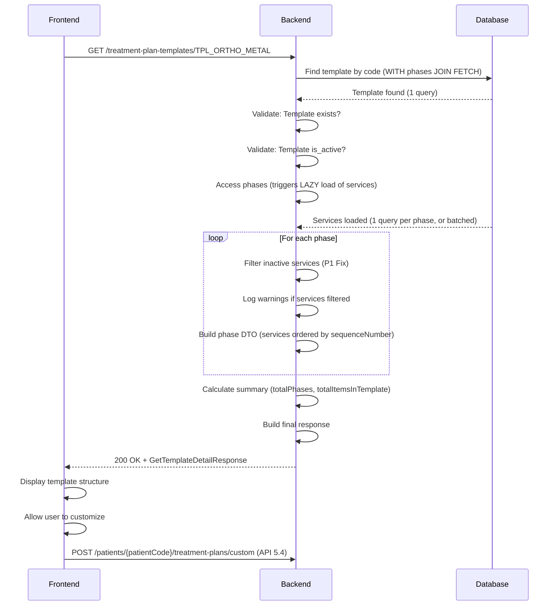

# API 5.8: Get Treatment Plan Template Detail

## Tổng Quan (Overview)

API này cho phép lấy chi tiết cấu trúc của một "gói mẫu" (treatment plan template) để phục vụ luồng nghiệp vụ **"Hybrid"** (tạo lộ trình từ template nhưng có tùy chỉnh).

**Use Case Thực Tế:**

- Bác sĩ muốn tạo lộ trình niềng răng dựa trên gói mẫu "TPL_ORTHO_METAL"
- Nhưng cần tùy chỉnh: Thêm dịch vụ "Nhổ răng khôn", giảm số lần tái khám từ 24 xuống 12
- Bác sĩ gọi API 5.8 → Xem cấu trúc gói mẫu (4 phases, 7 services)
- Bác sĩ customize trên FE → Thêm/bớt dịch vụ, sửa số lượng, điều chỉnh giá
- Bác sĩ gửi cấu trúc đã tùy chỉnh đến API 5.4 (Create Custom Plan)

**Tính Năng Chính:**

-  **Load full structure**: Template → Phases → Services (tối ưu 1-2 queries)
-  **Nested validation (P1 Fix)**: Tự động lọc bỏ dịch vụ inactive, log warning
-  **Enhanced error handling (P2 Fix)**: 404 (not found) vs 410 GONE (inactive)
-  **Rich metadata (P2 Enhancement)**: Summary, description, specialization (reserved)

---

## Thông Tin API (API Information)

| Thuộc tính              | Giá trị                                             |
| ----------------------- | --------------------------------------------------- |
| **HTTP Method**         | `GET`                                               |
| **Endpoint**            | `/api/v1/treatment-plan-templates/{templateCode}`   |
| **Content-Type**        | `application/json`                                  |
| **Authorization**       | Bearer Token (JWT)                                  |
| **Required Permission** | `CREATE_TREATMENT_PLAN` (P1 Fix - removed VIEW_ALL) |
| **Allowed Roles**       | ROLE_ADMIN, ROLE_MANAGER, ROLE_DENTIST              |

---

**Problem**:

- `VIEW_TREATMENT_PLAN_ALL` = Quyền xem lộ trình điều trị của **bệnh nhân** (sensitive data)
- Templates = "Master data" của phòng khám (catalog)
- Không nên mix permissions giữa patient data và master data

@PreAuthorize("hasAuthority('CREATE_TREATMENT_PLAN')")

````

**Rationale**: Chỉ người có quyền "Tạo lộ trình" mới cần xem "Nguyên liệu" (templates).

---

### P1 Fix: Nested Validation (CRITICAL)

**Issue**: Template có thể chứa dịch vụ bị inactive (`is_active = false`)

**Problem**:

- FE nhận template → Cố gắng tạo plan → BE reject vì service inactive
- Thảm họa UX (user đã customize xong mới biết template lỗi)

**Solution**:

```java
// Filter inactive services from phases
for (TemplatePhaseService tps : phaseServices) {
    if (tps.getService() != null && tps.getService().getIsActive()) {
        activeServices.add(tps);
    } else {
        log.warn("️ Filtering inactive service: {}", serviceCode);
        filteredServicesCount++;
    }
}
````

**Rationale**: BE tự động lọc, FE luôn nhận "clean" template.

---

### P2 Enhancement: Error Handling

**Issue**: Original spec chỉ có 404 NOT_FOUND

**Enhancement**:

```java
// Case 1: Template không tồn tại
throw new ResponseStatusException(HttpStatus.NOT_FOUND, "Template not found: ...");

// Case 2: Template bị vô hiệu hóa (P2 Fix)
throw new ResponseStatusException(HttpStatus.GONE, "Template is inactive (deprecated): ...");
```

**Benefits**:

- 404: Template code sai, hoặc chưa có trong DB
- 410 GONE: Template tồn tại nhưng đã bị deprecated → FE hiển thị message khác

---

### P2 Enhancement: Response Metadata

**Added Fields**:

```json
{
  "description": "Gói điều trị chỉnh nha toàn diện...", //  NEW
  "specialization": {
    //  NEW - Loaded from DB (specialization_id FK)
    "id": 1,
    "name": "Chỉnh nha"
  },
  "summary": {
    //  NEW
    "totalPhases": 4,
    "totalItemsInTemplate": 7
  }
}
```

**Benefits**:

- `description`: Giúp Bác sĩ hiểu template dùng cho case nào
- `specialization`: FE không cần gọi thêm API để lấy tên chuyên khoa
- `summary`: Quick overview trước khi render full list

---

## Request Parameters

| Parameter      | Type     | Required | Location | Description                                                |
| -------------- | -------- | -------- | -------- | ---------------------------------------------------------- |
| `templateCode` | `string` |  Yes   | Path     | Mã gói mẫu (e.g., "TPL_ORTHO_METAL", "TPL_IMPLANT_OSSTEM") |

**Example:**

```bash
GET /api/v1/treatment-plan-templates/TPL_ORTHO_METAL
```

---

## Response Body (200 OK)

### Success Response Structure

```json
{
  "templateId": 1,
  "templateCode": "TPL_ORTHO_METAL",
  "templateName": "Gói Niềng Răng Mắc Cài Kim Loại (Cơ bản)",
  "description": "Gói điều trị chỉnh nha toàn diện với mắc cài kim loại, bao gồm 24 lần tái khám siết niềng định kỳ.",

  "specialization": {
    "id": 1,
    "name": "Chỉnh nha"
  },

  "estimatedTotalCost": 30000000,
  "estimatedDurationDays": 730,
  "createdAt": "2025-01-01T10:00:00",
  "isActive": true,

  "summary": {
    "totalPhases": 4,
    "totalItemsInTemplate": 7
  },

  "phases": [
    {
      "phaseTemplateId": 1,
      "phaseName": "Giai đoạn 1: Khám & Chuẩn bị",
      "stepOrder": 1,
      "itemsInPhase": [
        {
          "serviceCode": "ORTHO_CONSULT",
          "serviceName": "Khám & Tư vấn Chỉnh nha",
          "price": 0,
          "quantity": 1,
          "sequenceNumber": 1
        },
        {
          "serviceCode": "ORTHO_FILMS",
          "serviceName": "Chụp Phim Chỉnh nha (Pano, Ceph)",
          "price": 500000,
          "quantity": 1,
          "sequenceNumber": 2
        },
        {
          "serviceCode": "SCALING_L1",
          "serviceName": "Lấy cao răng Level 1",
          "price": 300000,
          "quantity": 1,
          "sequenceNumber": 3
        }
      ]
    },
    {
      "phaseTemplateId": 2,
      "phaseName": "Giai đoạn 2: Gắn mắc cài",
      "stepOrder": 2,
      "itemsInPhase": [
        {
          "serviceCode": "ORTHO_BRACES_ON",
          "serviceName": "Gắn Mắc Cài Kim Loại (Full)",
          "price": 8000000,
          "quantity": 1,
          "sequenceNumber": 1
        }
      ]
    },
    {
      "phaseTemplateId": 3,
      "phaseName": "Giai đoạn 3: Tái khám định kỳ (24 tháng)",
      "stepOrder": 3,
      "itemsInPhase": [
        {
          "serviceCode": "ORTHO_ADJUST",
          "serviceName": "Tái khám Chỉnh nha / Siết niềng",
          "price": 500000,
          "quantity": 24, // FE sẽ nhận số 24 này
          "sequenceNumber": 1
        }
      ]
    },
    {
      "phaseTemplateId": 4,
      "phaseName": "Giai đoạn 4: Tháo niềng & Duy trì",
      "stepOrder": 4,
      "itemsInPhase": [
        {
          "serviceCode": "ORTHO_BRACES_OFF",
          "serviceName": "Tháo Mắc Cài & Vệ sinh",
          "price": 1000000,
          "quantity": 1,
          "sequenceNumber": 1
        },
        {
          "serviceCode": "ORTHO_RETAINER_REMOV",
          "serviceName": "Làm Hàm Duy Trì (Retainer) Tháo Lắp",
          "price": 2000000,
          "quantity": 1,
          "sequenceNumber": 2
        }
      ]
    }
  ]
}
```

### Field Descriptions

| Field Path                      | Type       | Description                                          |
| ------------------------------- | ---------- | ---------------------------------------------------- |
| `templateId`                    | `number`   | ID của template (PK)                                 |
| `templateCode`                  | `string`   | Mã template (unique, e.g., "TPL_ORTHO_METAL")        |
| `templateName`                  | `string`   | Tên gói mẫu                                          |
| `description`                   | `string`   | Mô tả chi tiết (P2 Enhancement)                      |
| **`specialization`**            | `object`   | **Chuyên khoa mà template thuộc về**                 |
| `specialization.id`             | `number`   | ID chuyên khoa (e.g., 1 = Chỉnh nha)                 |
| `specialization.name`           | `string`   | Tên chuyên khoa (e.g., "Chỉnh nha")                  |
| `estimatedTotalCost`            | `number`   | Tổng chi phí ước tính (từ template)                  |
| `estimatedDurationDays`         | `number`   | Thời gian điều trị ước tính (ngày)                   |
| `createdAt`                     | `datetime` | Ngày tạo template                                    |
| `isActive`                      | `boolean`  | Template có đang active không                        |
| **`summary`**                   | `object`   | **Thống kê tổng quan (P2 Enhancement)**              |
| `summary.totalPhases`           | `number`   | Tổng số phases                                       |
| `summary.totalItemsInTemplate`  | `number`   | Tổng số loại dịch vụ (không tính quantity)           |
| **`phases[]`**                  | `array`    | **Danh sách phases (ordered by stepOrder)**          |
| `phases[].phaseTemplateId`      | `number`   | ID của phase template                                |
| `phases[].phaseName`            | `string`   | Tên phase                                            |
| `phases[].stepOrder`            | `number`   | Thứ tự phase (1, 2, 3, 4, ...)                       |
| **`phases[].itemsInPhase[]`**   | `array`    | **Services trong phase (ordered by sequenceNumber)** |
| `itemsInPhase[].serviceCode`    | `string`   | Mã dịch vụ (từ services table)                       |
| `itemsInPhase[].serviceName`    | `string`   | Tên dịch vụ                                          |
| `itemsInPhase[].price`          | `number`   | **Giá gốc từ services table** (NOT snapshot)         |
| `itemsInPhase[].quantity`       | `number`   | Số lượng (FE nhận raw value, ví dụ 24)               |
| `itemsInPhase[].sequenceNumber` | `number`   | Thứ tự trong phase                                   |

---

## ️ QUAN TRỌNG: Understanding Quantity Field

### What FE Receives

```json
{
  "serviceCode": "ORTHO_ADJUST",
  "serviceName": "Tái khám Chỉnh nha",
  "price": 500000,
  "quantity": 24 //  FE nhận số RAW
}
```

**FE có thể:**

- Giảm quantity: 24 → 12 (nếu bệnh nhân chỉ cần 12 tháng)
- Tăng quantity: 24 → 36 (nếu cần 3 năm)
- Giữ nguyên: 24

### What Happens During Plan Creation (API 5.4)

Khi FE gửi cấu trúc đã tùy chỉnh đến API 5.4:

```json
// FE sends (customized)
{
  "serviceCode": "ORTHO_ADJUST",
  "quantity": 12 // Giảm từ 24 xuống 12
}
```

**BE sẽ expand**:

```
Tạo 12 items riêng biệt:
- Item 1: "Tái khám Chỉnh nha (Lần 1)", sequenceNumber=1
- Item 2: "Tái khám Chỉnh nha (Lần 2)", sequenceNumber=2
- ...
- Item 12: "Tái khám Chỉnh nha (Lần 12)", sequenceNumber=12
```

**Summary**:

- API 5.8 (this API): Trả về `quantity` nguyên thủy (template value)
- API 5.4 (create plan): Nhận `quantity` đã customize và expand ra nhiều items

---

## Business Logic Flow

### Step-by-Step Execution



---

### Detailed Logic

#### **1. Load Template with Phases**

```java
TreatmentPlanTemplate template = templateRepository
    .findByTemplateCodeWithFullStructure(templateCode)
    .orElseThrow(() -> new ResponseStatusException(
        HttpStatus.NOT_FOUND,
        "Template not found: " + templateCode
    ));

// Query executed:
// SELECT DISTINCT t FROM TreatmentPlanTemplate t
// LEFT JOIN FETCH t.templatePhases
// WHERE t.templateCode = :templateCode
```

**Performance**: 1 query loads template + phases

---

#### **2. Validate Template is Active (P2 Fix)**

```java
if (!template.getIsActive()) {
    throw new ResponseStatusException(
        HttpStatus.GONE,  // 410 GONE (not 404)
        "Template is inactive (deprecated): " + templateCode
    );
}
```

**Error Handling**:

- 404 NOT_FOUND: Template không tồn tại trong DB
- 410 GONE: Template tồn tại nhưng bị vô hiệu hóa

---

#### **3. Filter Inactive Services (P1 Fix - Nested Validation)**

```java
for (TemplatePhase phase : phases) {
    List<TemplatePhaseService> phaseServices = phase.getPhaseServices();
    List<TemplatePhaseService> activeServices = new ArrayList<>();

    for (TemplatePhaseService tps : phaseServices) {
        if (tps.getService() != null && tps.getService().getIsActive()) {
            activeServices.add(tps);
        } else {
            log.warn("️ Filtering inactive service: {} from phase: {}",
                    serviceCode, phaseName);
            filteredServicesCount++;
        }
    }

    // Use only activeServices for response
}
```

**Why This Matters**:

- Ngăn FE nhận template "broken" (chứa service inactive)
- Log warning → Admin biết cần update template
- FE luôn nhận "clean" template → Tạo plan thành công

---

#### **4. Build Phase DTOs (Sorted)**

```java
List<PhaseDTO> phaseDTOs = new ArrayList<>();

for (TemplatePhase phase : phases) {
    // Services already sorted by @OrderBy("sequenceNumber ASC")
    List<PhaseServiceDTO> serviceDTOs = activeServices.stream()
        .map(tps -> PhaseServiceDTO.builder()
            .serviceCode(tps.getService().getServiceCode())
            .serviceName(tps.getService().getServiceName())
            .price(tps.getService().getPrice())  // Giá gốc
            .quantity(tps.getQuantity())
            .sequenceNumber(tps.getSequenceNumber())
            .build())
        .collect(Collectors.toList());

    phaseDTOs.add(new PhaseDTO(
        phaseId, phaseName, phaseNumber, serviceDTOs
    ));
}
```

**Ordering**:

- Phases: Sorted by `phaseNumber` ASC (via `@OrderBy` in entity)
- Services: Sorted by `sequenceNumber` ASC (via `@OrderBy` in TemplatePhase)

---

#### **5. Calculate Summary (P2 Enhancement)**

```java
int totalPhases = phaseDTOs.size();
int totalItemsInTemplate = phaseDTOs.stream()
    .mapToInt(phase -> phase.getItemsInPhase().size())
    .sum();

SummaryDTO summary = new SummaryDTO(totalPhases, totalItemsInTemplate);
```

**Example**:

- totalPhases = 4
- totalItemsInTemplate = 7 (3 services in phase 1, 1 in phase 2, 1 in phase 3, 2 in phase 4)

---

## Error Responses

### 404 Not Found - Template Không Tồn Tại

```json
{
  "timestamp": "2025-01-15T14:30:00",
  "status": 404,
  "error": "Not Found",
  "message": "Treatment plan template not found with code: INVALID_CODE",
  "path": "/api/v1/treatment-plan-templates/INVALID_CODE"
}
```

**Cause**: Template code sai hoặc chưa có trong DB

---

### 410 Gone - Template Bị Vô Hiệu Hóa (P2 Enhancement)

```json
{
  "timestamp": "2025-01-15T14:30:00",
  "status": 410,
  "error": "Gone",
  "message": "Treatment plan template is inactive (deprecated): TPL_OLD_ORTHO",
  "path": "/api/v1/treatment-plan-templates/TPL_OLD_ORTHO"
}
```

**Cause**: Template `is_active = false` (đã bị deprecated)

**Difference from 404**:

- 404: Không tìm thấy (có thể do code sai)
- 410: Tìm thấy nhưng không còn available (đã bị vô hiệu hóa)

---

### 403 Forbidden - Thiếu Quyền

```json
{
  "timestamp": "2025-01-15T14:30:00",
  "status": 403,
  "error": "Forbidden",
  "message": "Access Denied",
  "path": "/api/v1/treatment-plan-templates/TPL_ORTHO_METAL"
}
```

**Cause**: User không có quyền `CREATE_TREATMENT_PLAN`

---

## Use Cases (Tình Huống Thực Tế)

### Use Case 1: Load Template để Customize (Happy Path)

**Scenario:**

- Bác sĩ muốn tạo lộ trình niềng răng cho bệnh nhân BN-1001
- Dựa trên gói mẫu "TPL_ORTHO_METAL"
- Nhưng cần customize: Thêm "Nhổ răng khôn", giảm tái khám từ 24 → 12 lần

**Step 1: Load Template**

```bash
curl -X GET https://api.example.com/api/v1/treatment-plan-templates/TPL_ORTHO_METAL \
  -H "Authorization: Bearer YOUR_JWT_TOKEN"
```

**Response (200 OK)**:

```json
{
  "templateCode": "TPL_ORTHO_METAL",
  "summary": {
    "totalPhases": 4,
    "totalItemsInTemplate": 7
  },
  "phases": [
    { "stepOrder": 1, "itemsInPhase": [...] },
    { "stepOrder": 2, "itemsInPhase": [...] },
    {
      "stepOrder": 3,
      "itemsInPhase": [
        {
          "serviceCode": "ORTHO_ADJUST",
          "quantity": 24  //  FE nhận 24
        }
      ]
    },
    { "stepOrder": 4, "itemsInPhase": [...] }
  ]
}
```

**Step 2: FE Customizes**

```javascript
// User changes quantity
phases[2].itemsInPhase[0].quantity = 12; // 24 → 12

// User adds new service to phase 1
phases[0].itemsInPhase.push({
  serviceCode: "EXTRACTION_SIMPLE",
  price: 300000,
  quantity: 2, // Nhổ 2 răng khôn
});
```

**Step 3: Create Custom Plan (API 5.4)**

```bash
curl -X POST https://api.example.com/api/v1/patients/BN-1001/treatment-plans/custom \
  -H "Authorization: Bearer YOUR_JWT_TOKEN" \
  -d '{ "phases": [...customized structure...] }'
```

---

### Use Case 2: Template Có Service Inactive (P1 Fix Validation)

**Scenario:**

- Template "TPL_ORTHO_METAL" có service "OLD_SERVICE" bị inactive
- BE tự động lọc bỏ và log warning

**Request:**

```bash
GET /api/v1/treatment-plan-templates/TPL_ORTHO_METAL
```

**Backend Log:**

```
️ Filtering inactive service from template: Phase=Giai đoạn 1, Service=OLD_SERVICE (Dịch vụ cũ)
️ Filtered 1 inactive services from template TPL_ORTHO_METAL
```

**Response (200 OK)**:

```json
{
  "templateCode": "TPL_ORTHO_METAL",
  "summary": {
    "totalItemsInTemplate": 6  // Giảm từ 7 → 6 (filtered 1 service)
  },
  "phases": [
    {
      "stepOrder": 1,
      "itemsInPhase": [
        // OLD_SERVICE KHÔNG có trong list
        { "serviceCode": "ORTHO_CONSULT", ... },
        { "serviceCode": "ORTHO_FILMS", ... }
      ]
    }
  ]
}
```

**Result**: FE nhận "clean" template, không cần xử lý inactive services

---

### Use Case 3: Template Không Tồn Tại (Error Case)

**Request:**

```bash
GET /api/v1/treatment-plan-templates/INVALID_CODE
```

**Response (404 NOT_FOUND)**:

```json
{
  "status": 404,
  "error": "Not Found",
  "message": "Treatment plan template not found with code: INVALID_CODE"
}
```

**FE Action**: Hiển thị "Gói mẫu không tồn tại"

---

### Use Case 4: Template Bị Vô Hiệu Hóa (P2 Enhancement)

**Scenario**: Template "TPL_OLD_ORTHO" đã bị deprecated (`is_active = false`)

**Request:**

```bash
GET /api/v1/treatment-plan-templates/TPL_OLD_ORTHO
```

**Response (410 GONE)**:

```json
{
  "status": 410,
  "error": "Gone",
  "message": "Treatment plan template is inactive (deprecated): TPL_OLD_ORTHO"
}
```

**FE Action**: Hiển thị "Gói mẫu này đã ngừng sử dụng. Vui lòng chọn gói khác."

---

### Use Case 5: Hybrid Workflow - Full Example

**Scenario**: Tạo lộ trình implant với customize

**Step 1: Load Template**

```bash
GET /api/v1/treatment-plan-templates/TPL_IMPLANT_OSSTEM
```

**Response**:

```json
{
  "templateCode": "TPL_IMPLANT_OSSTEM",
  "templateName": "Cấy ghép Implant Hàn Quốc (Osstem)",
  "estimatedTotalCost": 19000000,
  "phases": [
    {
      "phaseName": "Giai đoạn 1: Khám & Chẩn đoán",
      "itemsInPhase": [
        { "serviceCode": "IMPL_CONSULT", "price": 0, "quantity": 1 },
        { "serviceCode": "IMPL_CT_SCAN", "price": 1500000, "quantity": 1 }
      ]
    },
    {
      "phaseName": "Giai đoạn 2: Phẫu thuật",
      "itemsInPhase": [
        { "serviceCode": "IMPL_SURGERY_KR", "price": 12000000, "quantity": 1 }
      ]
    },
    {
      "phaseName": "Giai đoạn 3: Làm răng sứ",
      "itemsInPhase": [
        { "serviceCode": "IMPL_CROWN_ZIR", "price": 5500000, "quantity": 1 }
      ]
    }
  ]
}
```

**Step 2: FE Customizes**

- Thêm "Ghép xương" vào Phase 2 (nếu bệnh nhân thiếu xương)
- Đổi răng sứ từ Zirconia → Cercon HT (giá thấp hơn)

**Step 3: Send to API 5.4**

```javascript
POST /api/v1/patients/BN-1002/treatment-plans/custom
{
  "doctorEmployeeCode": "DR_AN_KHOA",
  "discountAmount": 1000000,
  "phases": [
    { /* Phase 1 - unchanged */ },
    {
      "phaseNumber": 2,
      "phaseName": "Giai đoạn 2: Phẫu thuật",
      "items": [
        { "serviceCode": "IMPL_BONE_GRAFT", "price": 3000000, "quantity": 1 },  // NEW
        { "serviceCode": "IMPL_SURGERY_KR", "price": 12000000, "quantity": 1 }
      ]
    },
    {
      "phaseNumber": 3,
      "phaseName": "Giai đoạn 3: Làm răng sứ",
      "items": [
        { "serviceCode": "IMPL_CROWN_CERCON", "price": 4000000, "quantity": 1 }  // CHANGED
      ]
    }
  ]
}
```

---

## Security & Permissions

### Required Permission (P1 Fix)

```java
@PreAuthorize("hasRole('ROLE_ADMIN') or hasAuthority('CREATE_TREATMENT_PLAN')")
```

### Who Can Use This API?

| Role        | Permission              | Can Access? | Rationale                                 |
| ----------- | ----------------------- | ----------- | ----------------------------------------- |
| **ADMIN**   | Always has access       |  Yes      | Full system access                        |
| **MANAGER** | `CREATE_TREATMENT_PLAN` |  Yes      | Can create plans → needs templates        |
| **DENTIST** | `CREATE_TREATMENT_PLAN` |  Yes      | Main user of this API                     |
| **NURSE**   |  No permission        |  No       | Cannot create plans → không cần templates |
| **PATIENT** |  No permission        |  No       | Cannot create plans                       |

---

## Testing Guide

### Prerequisites

```bash
# 1. Get JWT token
LOGIN_RESPONSE=$(curl -X POST https://api.example.com/api/v1/auth/login \
  -H "Content-Type: application/json" \
  -d '{"username": "admin", "password": "admin123"}')

TOKEN=$(echo $LOGIN_RESPONSE | jq -r '.token')
```

---

### Test Case 1: Get Template Detail (Happy Path)

```bash
# GIVEN: Template TPL_ORTHO_METAL exists and is active
# WHEN: Request template detail
curl -X GET https://api.example.com/api/v1/treatment-plan-templates/TPL_ORTHO_METAL \
  -H "Authorization: Bearer $TOKEN"

# THEN:
# - 200 OK
# - Response contains: templateId, templateCode, templateName
# - phases[] array with stepOrder 1,2,3,4
# - Each phase has itemsInPhase[] sorted by sequenceNumber
# - summary { totalPhases: 4, totalItemsInTemplate: 7 }
```

---

### Test Case 2: Template Not Found (Negative Test)

```bash
# GIVEN: Template INVALID_CODE does not exist
# WHEN: Request template detail
curl -X GET https://api.example.com/api/v1/treatment-plan-templates/INVALID_CODE \
  -H "Authorization: Bearer $TOKEN"

# THEN:
# - 404 Not Found
# - Error message: "Treatment plan template not found with code: INVALID_CODE"
```

---

### Test Case 3: Template Inactive (P2 Enhancement - Negative Test)

```bash
# GIVEN: Template TPL_OLD exists but is_active = false
# WHEN: Request template detail
curl -X GET https://api.example.com/api/v1/treatment-plan-templates/TPL_OLD \
  -H "Authorization: Bearer $TOKEN"

# THEN:
# - 410 Gone
# - Error message: "Treatment plan template is inactive (deprecated): TPL_OLD"
```

---

### Test Case 4: Insufficient Permission (Negative Test)

```bash
# GIVEN: Login as PATIENT (no CREATE_TREATMENT_PLAN)
PATIENT_TOKEN=$(curl -X POST .../auth/login -d '{"username": "patient1"}' | jq -r '.token')

# WHEN: Request template detail
curl -X GET https://api.example.com/api/v1/treatment-plan-templates/TPL_ORTHO_METAL \
  -H "Authorization: Bearer $PATIENT_TOKEN"

# THEN:
# - 403 Forbidden
# - Error: "Access Denied"
```

---

### Test Case 5: Verify Nested Validation (P1 Fix)

**Setup**: Manually set 1 service in template to `is_active = false`

```sql
UPDATE services SET is_active = false WHERE service_code = 'OLD_SERVICE';
```

**Test**:

```bash
curl -X GET .../treatment-plan-templates/TPL_ORTHO_METAL \
  -H "Authorization: Bearer $TOKEN"
```

**Expected**:

- Response 200 OK
- `totalItemsInTemplate` decreased by 1 (filtered inactive service)
- Backend log shows: `️ Filtering inactive service: OLD_SERVICE`

---

### Test Case 6: Verify Performance (N+1 Prevention)

**Enable SQL Logging**:

```yaml
# application.yaml
spring:
  jpa:
    show-sql: true
```

**Test**:

```bash
curl -X GET .../treatment-plan-templates/TPL_ORTHO_METAL
```

**Expected Queries**:

```sql
-- Query 1: Load template + phases
SELECT DISTINCT t FROM TreatmentPlanTemplate t
LEFT JOIN FETCH t.templatePhases
WHERE t.templateCode = 'TPL_ORTHO_METAL'

-- Query 2: Load services (batch or lazy)
SELECT * FROM template_phase_services WHERE phase_id IN (...)
SELECT * FROM services WHERE service_id IN (...)
```

**Total Queries**: ≤ 3 queries (NOT 1 query per phase)

---

## Database Impact

### Tables Queried

| Table                      | Action              | Purpose                                 |
| -------------------------- | ------------------- | --------------------------------------- |
| `treatment_plan_templates` | SELECT              | Load template info                      |
| `template_phases`          | SELECT (JOIN FETCH) | Load phases                             |
| `template_phase_services`  | SELECT (LAZY)       | Load services in phases                 |
| `services`                 | SELECT (LAZY)       | Get service details (code, name, price) |

### Example Query Execution

```sql
-- Step 1: Load template + phases (JOIN FETCH)
SELECT t.*, p.*
FROM treatment_plan_templates t
LEFT JOIN template_phases p ON t.template_id = p.template_id
WHERE t.template_code = 'TPL_ORTHO_METAL';

-- Step 2: Load services (when accessing phase.getPhaseServices())
SELECT tps.*, s.*
FROM template_phase_services tps
JOIN services s ON tps.service_id = s.service_id
WHERE tps.phase_id IN (1, 2, 3, 4);
```

---

## Best Practices

### 1. Display Specialization Information

```javascript
// Frontend code - Specialization is always populated from DB
if (response.specialization) {
  displaySpecialization(response.specialization.name);
  // Example: "Chuyên khoa: Chỉnh nha"
}
```

---

### 2. Use Summary for Quick UI

```javascript
// Show summary before loading full details
const { totalPhases, totalItemsInTemplate } = response.summary;

showSkeleton(
  `Đang tải ${totalPhases} giai đoạn, ${totalItemsInTemplate} dịch vụ...`
);

// Then render full structure
renderPhases(response.phases);
```

---

### 3. Preserve Order When Customizing

```javascript
// IMPORTANT: Maintain stepOrder and sequenceNumber when customizing

//  BAD: Add service without sequenceNumber
phases[0].itemsInPhase.push({
  serviceCode: "NEW_SERVICE",
  // Missing sequenceNumber!
});

//  GOOD: Calculate next sequenceNumber
const maxSeq = Math.max(...phases[0].itemsInPhase.map((i) => i.sequenceNumber));
phases[0].itemsInPhase.push({
  serviceCode: "NEW_SERVICE",
  sequenceNumber: maxSeq + 1,
});
```

---

### 4. Validate Before Sending to API 5.4

```javascript
// Before calling API 5.4, validate customized structure
function validateCustomPlan(phases) {
  for (const phase of phases) {
    if (phase.itemsInPhase.length === 0) {
      throw new Error(`Phase ${phase.phaseName} has no items`);
    }

    // Check for duplicate sequenceNumbers
    const seqNumbers = phase.itemsInPhase.map((i) => i.sequenceNumber);
    if (new Set(seqNumbers).size !== seqNumbers.length) {
      throw new Error(`Phase ${phase.phaseName} has duplicate sequenceNumbers`);
    }
  }
}
```

---

## Related APIs

| API     | Purpose                   | Relationship                                             |
| ------- | ------------------------- | -------------------------------------------------------- |
| API 5.3 | Create plan from template | Alternative to hybrid workflow (no customization)        |
| API 5.4 | Create custom plan        | **Next step** after this API (send customized structure) |
| API 5.1 | Get plans list            | View existing plans before deciding to create new        |
| API 6.x | Get services list         | Browse all available services for customization          |

---

## Troubleshooting

### Problem 1: "Template not found" but code is correct

**Possible Causes**:

1. Template code có space hoặc typo
2. Template chưa được seed vào DB

**Solution**:

```bash
# Check available templates
SELECT template_code FROM treatment_plan_templates WHERE is_active = true;

# Expected: TPL_ORTHO_METAL, TPL_IMPLANT_OSSTEM, TPL_CROWN_CERCON
```

---

### Problem 2: Response has fewer items than expected

**Cause**: P1 Fix đã filter inactive services

**Solution**:

```bash
# Check backend logs
grep "Filtering inactive service" application.log

# If services are filtered, admin should:
# 1. Update template to use active services
# 2. Or reactivate the services
UPDATE services SET is_active = true WHERE service_code = 'OLD_SERVICE';
```

---

### Problem 3: Performance issue with large templates

**Cause**: N+1 query problem

**Solution**:

```bash
# Enable SQL logging to verify
spring.jpa.show-sql=true

# Expected: ≤3 queries
# If you see 10+ queries, check JOIN FETCH is working
```

---

## Changelog

### Version 1.0 (2025-01-15)

-  Initial release
-  P1 Fix: Permission (removed VIEW_ALL, only CREATE_TREATMENT_PLAN)
-  P1 Fix: Nested validation (filter inactive services)
-  P2 Enhancement: Error handling (404 vs 410 GONE)
-  P2 Enhancement: Response metadata (specialization, summary, description)
-  Performance optimization (JOIN FETCH for 1-2 queries)
-  Comprehensive logging (warnings for filtered services)

---

## Support

Nếu có vấn đề khi sử dụng API này:

1. Kiểm tra error response (404/403/410)
2. Xem backend logs (search "API 5.8")
3. Verify permission (`CREATE_TREATMENT_PLAN`)
4. Check template exists and is_active
5. Enable SQL logging để debug performance
6. Liên hệ team backend nếu gặp lỗi 500

**Backend Implementation**:

- Service: `TreatmentPlanTemplateService.java`
- Controller: `TreatmentPlanController.java` (API 5.8)
- Repository: `TreatmentPlanTemplateRepository.java`
- Permission Required: `CREATE_TREATMENT_PLAN`
